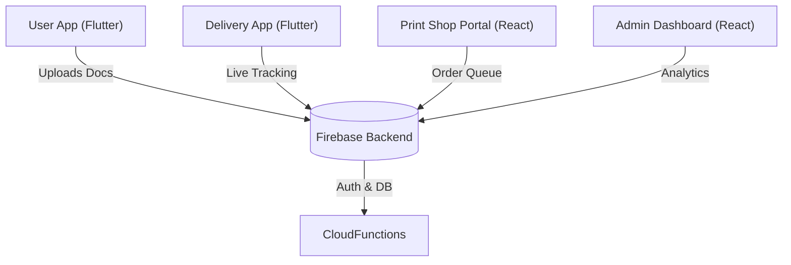

<h1 align="center">🚀 Manu H — Full Stack Developer</h1>

  Building scalable, cross-platform ecosystems using 
  <strong>Flutter • React • Firebase</strong> 
  Founder & Solo Developer of <strong>Printit</strong> — The “Printer on Wheels”

  

---

# 🖨️ Featured Project: Printit

**Status:** Under Active Development 🚧 | **Current Phase:** MVP Construction  
**Role:** Founder & Sole Architect

**Printit** is a hyperlocal service aggregation platform (The "Zomato for Printers") that connects users with local print shops, streamlining the document printing workflow through a digital ecosystem.

---

## 🏗️ System Architecture

I architected a **4-Portal Ecosystem** to handle the complex logistics of printing and delivery:

## 🛠️ Tech Stack

- **Mobile Apps:** Flutter (Provider State Management, Google Maps API)
- **Web Portals:** React.js (Material UI, Redux)
- **Backend:** Firebase (Firestore, Cloud Functions, Auth)
- **Payment:** Razorpay Integration

---

## 📱 App Screenshots

| User App (Landing) | Authentication | Shop Listing | Document Upload |
|:---:|:---:|:---:|:---:|
|  |  |  |  |

| Delivery Tracking | Print Shop Dashboard | Admin Analytics |
|:---:|:---:|:---:|
|  |  |  |

---

## 🚀 Key Features

- **Algorithm:** Location-based print shop discovery and cost estimation
- **Real-time:** Live status updates (Processing → Printed → Out for Delivery)
- **Security:** Secure file transfer + auto-deletion post printing
- **Logistics:** Dedicated delivery partner app with route optimization

---

## 🔒 Why is there no code here?

Printit is a live startup product.  
To protect our **Intellectual Property (IP)** and business logic, the source code is kept private.

This repository serves as a **technical showcase** of the architecture, UI/UX, and system design.

I’m happy to provide a code walkthrough or discuss the architecture during an interview.

---

## 🗺️ Development Roadmap

I am actively building the MVP for the Davanagere market.

- [x] **Phase 1: Core Marketplace (Completed)** ✅
    - [x] **User App (Flutter):** Full working flow, file upload, searching printers, and Order tracking.
    - [x] **Print Shop Portal (React):** Real-time order reception, status updates, and queue management.
    - [x] **Backend:** Firestore Schema & Auth System (User/Shop).

- [ ] **Phase 2: Logistics Ecosystem (In Progress)** 🚧
    - [ ] **Delivery App:** implementing real-time driver allocation logic.
    - [ ] **Admin Dashboard:** Building system-wide analytics and user management.
    - [ ] Integrating Google Maps Directions API for route optimization.

- [ ] **Phase 3: Beta Launch (Planned)**
    - [ ] Onboarding 5 local print shops for pilot testing.
    - [ ] End-to-end load testing.
